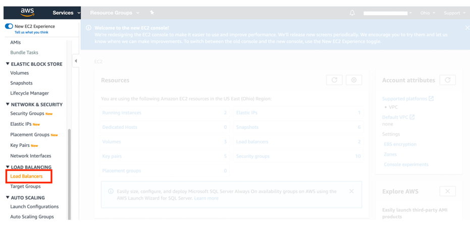
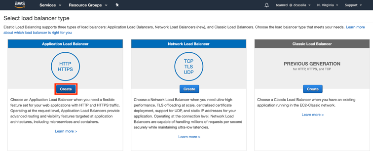
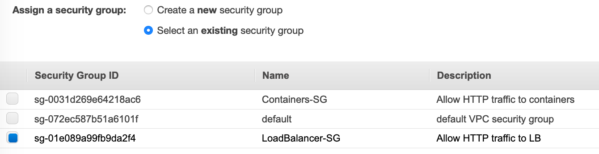

+++ 
title = "Task 4: Create an Application Load Balancer" 
chapter = false 
weight = 4 
+++

Sending incoming traffic through a load balancer is often a key piece of making an application both scalable and highly available. It can balance the traffic between multiple tasks, as well as ensure that traffic is only sent to healthy tasks. You can have the service manage the addition or removal of tasks from an Application Load Balancer as they come and go but that must be specified when the service is created. It’s a dependency that you create first.

1. Go to Service *search box* > EC2
 
1. In the left navigation pane, choose **Load Balancers**.

	
 
1. Click on **Create Load Balancer**.

	
 
1. Under **Application Load Balancer**, click on **Create**.

	
 
1. Under the **Basic Configuration** section, for **Name**, type `Fargate-LB`.
 
1. Under **Availability Zones**, choose the appropriate VPC (`VPC-Lab1`) and mark both Availabilty Zones checkboxes. Select the *public* subnets, `public-subnet-1` and `public-subnet-2`.

	
 
1. Click on **Next: Configure Security Settings**.

1. You will see a warning, disregard and click on **Next: Configure Security Groups**

1. In **Step 3: Configure Security Groups**, choose **Select an existing security group** and *only* select **LoadBalancer-SG**. 

	

1. Click on **Next: Configure Routing**.
 
1. Under the **Target group** section, for **Name**, type `Lab1-TG`. 

1. For **Target type**, select **IP**.
 
1. Click on **Next: Register Targets**.

1.  Click on **Next: Review**.
 
1.  Click on **Create**.

1. Click on **Close**.

1. You will find the Load Balancer DNS name it in the below panel. Copy and paste it on a note pad, you will need it to access the web site that will deployed in Task 5.

	
