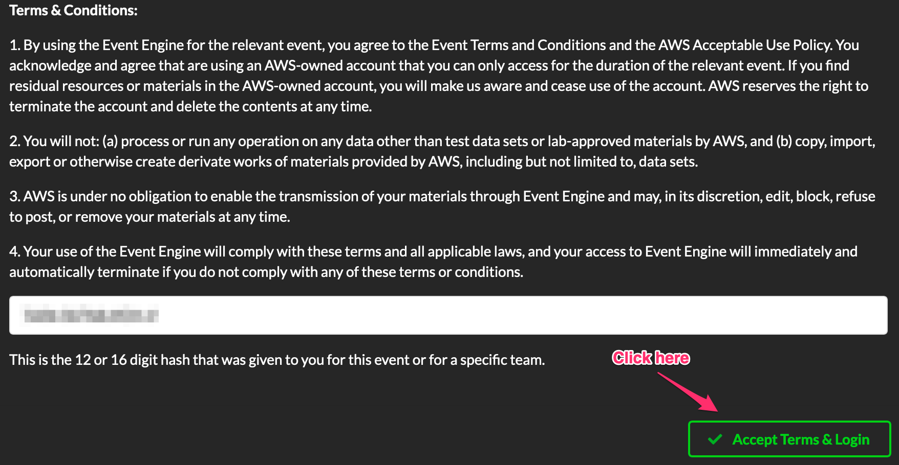
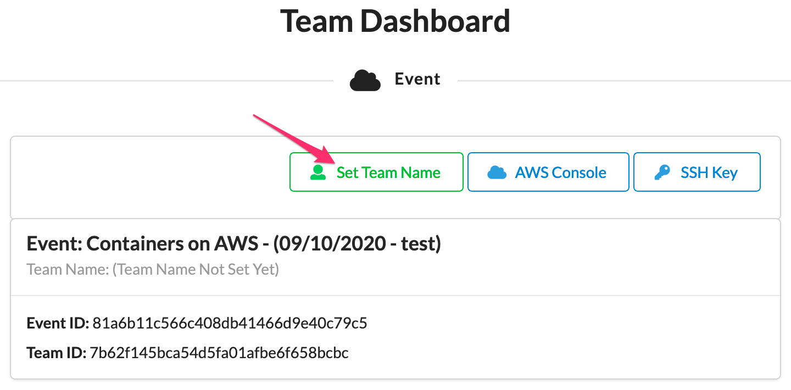
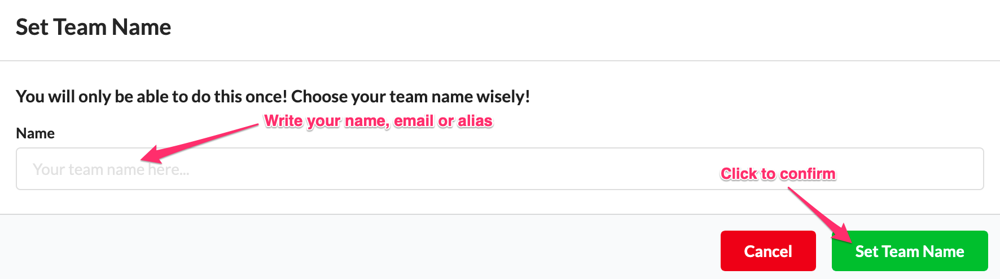
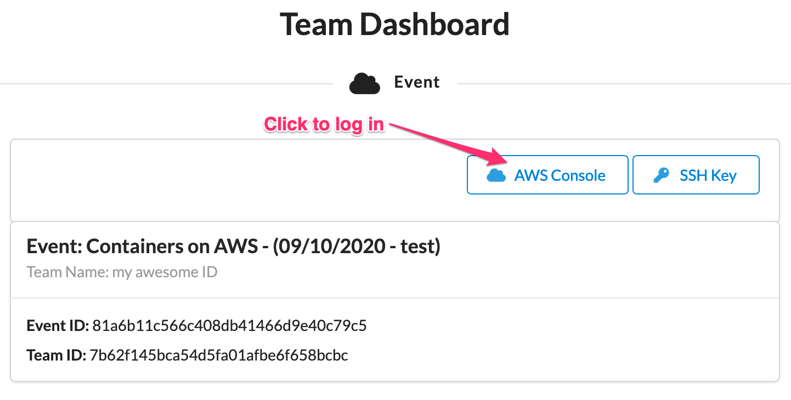
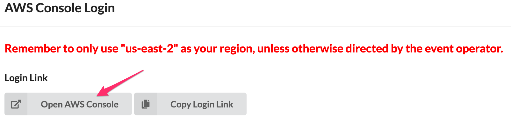
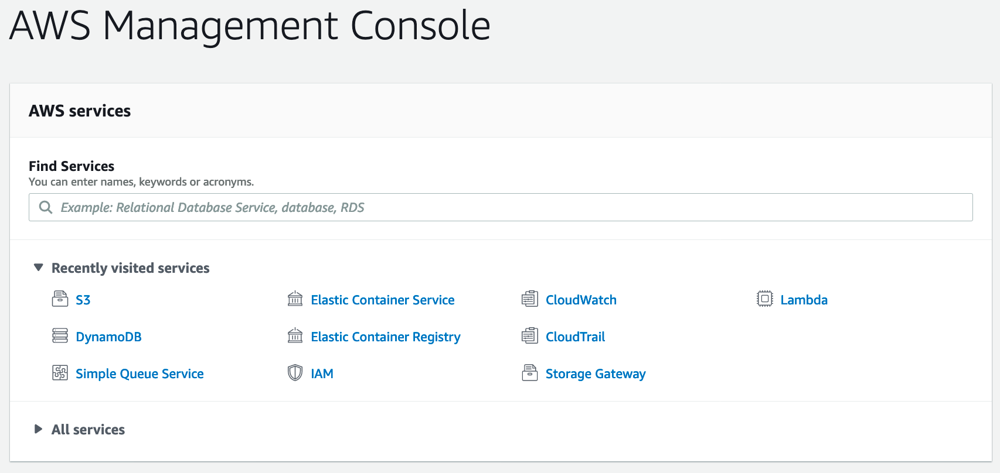

+++
title = "Event Engine Dashboard"
date = 2021-02-17T17:04:42-06:00
weight = 1
chapter = false
pre = "<b>0. </b>"
+++

## Lab access instructions

1. To access to lab environment you need to enter the following URL <a href="https://dashboard.eventengine.run/login" target="_blank">Event Engine Dashboard</a>

1. Enter the event hash provided by the instructor and click on **Accept Terms & Login**

	

1. In order to identify the account you will be using is necessary to change the default account ID. Please click on **Set Team Name**:

	

1. Enter your name, email or an alias:

	

1. You will be returned to your Dashboard, click on **AWS Console**:

	

1. ... and click on **Open AWS Console**:

	

1. There you go, enjoy!

	

