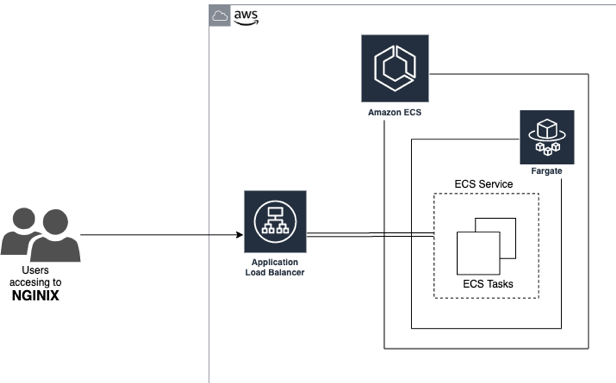

+++
title = "ECS"
date = 2021-02-17T17:04:42-06:00
weight = 2
chapter = false
pre = "<b>1. </b>"
+++

## Building and deploying a containerized application with AWS ECS

In this Lab you will learn how to use Amazon Elastic Container Service (ECS) using AWS Fargate as the deployment platform. AWS Fargate is a compute engine for Amazon ECS/EKS that runs containers without requiring you to deploy or manage the underlying Amazon EC2 instances. With Fargate, you specify an image to deploy and the amount of CPU and memory it requires. Fargate handles the updating and securing of the underlying Linux OS, Docker daemon, and ECS agent as well as all the infrastructure capacity management and scaling.

You will create an ECS cluster, a task definition, an Application Load Balancer and a service using AWS Fargate. You will do those activities using the AWS Management Console. At the end of this Lab, you will have a web page running on Amazon ECS with AWS Fargate. 

The following is the architecture that you will build in this Lab:

